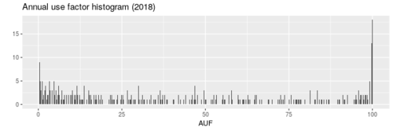

# Abstract

There are many ways to look at electronic resource use, individually or aggregated.
I propose two new metrics to help give a better understanding of comparative use across an online collection.
*Users per mille* is a relative annual measure of how many users a platform had for every thousand potential users: this tells us how many people used a given platform.
*Interest factor* is the average number of uses of a platform by people who used it more than once: this tells us how much people used a given platform.
These two metrics are enough to give us good insight into collection use.
Dividing each into quartiles allows a quadrant comparison of lows and highs on each metric, giving a quick view of platforms many people use a lot (the big expensive ones), many people use very little (a curious subset), a few people use a lot (very specific to a narrow subject) and a few people use very little (deserves attention).
This helps understand collection use and informs collection management.

# Introduction

In this article I put forward for consideration two metrics about electronic resource use:  *users per mille* and *interest factor*.
I will define them, show how they can be calculated, and then briefly examine what they tell us alone and together.

*Users per mille* (UPM) is how many of every thousand potential users actually uses a product.
("Per mille" is the thousands equivalent of "per cent.")

*Interest factor* (IF) is a measure of how interested in a product its users are.
The more they go back to it, the more interested they are, and the higher the interest factor.

One way of using these two metrics together is shown in the chart for Scholars Portal Books (a large Canadian consortial collection of ebooks).
The two measures have been simplified from raw numbers to rankings (fully explained below).
It shows that Scholars Portal Books has always been used a lot (high *users per mille* rank) but its *interest factor* rose over a few years from medium-low to high.
(I believe this is because the number of books available there increased greatly, so people kept going back.)

Looking at just the products that have either high or low rankings of users per mille or interest factor lets us make a quadrant chart showing products that either a lot of people or very few people use, and which they either use a lot or very little.

This is an informal article where I present a new idea.
My colleagues and I began to use these metrics in our collection management, but for various reasons (including the Covid-19 pandemic), have not used them seriously.
I cannot report, yet, on how effective they are or how they have changed our management of online resourcesa.
Nevertheless, I would like to put the ideas out and ask if others think these metrics could be useful.
If so, I hope you will try them out and see if they help you manage your own eresource collections.
Both are simple, but interest factor gets at something about eresource use that I have not seen discussed in the literature.

In this article I show my own methods and how I process the data I have on hand, but you can use your own to suit your circumstances.
I use a mix of scripts in [Ruby](https://www.ruby-lang.org/) (for processing data) and [R](https://www.r-project.org/) (for analysis).
I will show some of that code here, with links to a Git repository where more sits, but the presentation is mostly narrative.
Someone who prefers another language could do the same work in it.
I use EZProxy logs for data, but another authentication system would work equally well.
The implementation and use of the concepts is of more importance than the code used to determine the metrics.

# The data

## What data to use?

When assessing electronic resource use the obvious first choice are reports from the vendor, probably in the [COUNTER](https://www.projectcounter.org/) format.
They can be very useful, and the 2019 [Code of Practice for Release 5](https://www.projectcounter.org/code-of-practice-five-sections/abstract/) has many fine improvements, but for our purposes they are missing something crucial:  user identification.
COUNTER's [usage reports](https://www.projectcounter.org/code-of-practice-five-sections/4-1-usage-reports/) aggregate user activity into different types of totals.
This is good for many purposes and serves collection development librarians well.
It is also safe: there is no personally identifiable information.

But COUNTER does not tell us *how much* the product's users use it.
If something had a total of 2,000 item requests, was that 2,000 people using it hardly ever, or 200 people using it intensely?
This is what *interest factor* does.

Some vendors may make all users log in before accessing their platform.
If so, they could give that data to the library so it would know who had been looking at what.
I say *could*, but I certainly do not mean *should*.
Users should have the maximum amount of anonymity possible.
Even if some vendors did collect this data and give it to the library, not all do, so it could not be matched up with all of the other vendors and platforms.

IP-based authentication and proxies or virtual private networks that route users through their library's network mean that the vendors need not know who exactly is looking at what (aside from all the usual tracking web sites can do with cookies and such).
This is good.

But of course the library running the proxy and VPN knows.
It should have a good privacy policy.
It should manage this data carefully and delete it when it is not needed.
But if its policies permit, the library can use that data to help understand and manage its collections.
This type of data is what I use in this article to generate these new metrics.
My source here is [EZProxy](https://www.oclc.org/en/ezproxy.html) logs, but any other source that records the same information will do.

## Privacy

Using EZProxy means that we are dealing with personally identifiable information (PII): it connects people to online resources via their institutional ID.
Anything involving PII requires careful attention, and I assume that your institution has a good privacy policy for this data.

Happily, analysis like this should fit within most policies.
If yours allows the collection of PII (through EZProxy or whatever you're using), and also allows analysis of that data to manage and improve collections, then this analysis is in compliance with your policy.
It produces anonymized aggregate data with all personally identifiable information gone.
If your policy doesn't allow such work, then this is the kind of analysis you have chosen not to be able to do in order to maximize user privacy.

These reports can be kept and used after the source data has been wiped.
Whether you want to share the analyses outside your library depends on your openness about collection usage statistics, but there are no user privacy reasons preventing it.

## Raw data

We begin with the raw data from the [EZProxy logs](https://help.oclc.org/Library_Management/EZproxy/Manage_EZproxy/Log_files_overview).
These are HTTP server logs; an example (split across multiple lines) looks like this:

    10.31.41.59
    -
    29007019999999
    [30/Jun/2021:03:38:16 -0400]
    "GET https://www.jstor.org:443/assets/global_20210426T1829/build/icons/chevron-down.svg HTTP/1.1"
    200
    737
    "https://www-jstor-org.ezproxy.library.yorku.ca/stable/4500321"
    "Mozilla/5.0 (X11; Ubuntu; Linux x86_64; rv:89.0) Gecko/20100101 Firefox/89.0"

The first field is the client's IP address (here, faked) and the third is the userid, which for our institution is their library card number (also faked).
Then there is a timestamp, the HTTP request (here for a very small down arrow), its [status](https://datatracker.ietf.org/doc/html/rfc2616#section-10) (200 is "OK"), the number of bytes returned (737), the referring URL and the client's user agent.
When everything is proxied, that means *everything*, including each tiny little image.

We only care about three pieces of information:  the timestamp, the userid and the URL requested.

    29007019999999
    [30/Jun/2021:03:38:16 -0400]
    https://www.jstor.org:443/assets/global_20210426T1829/build/icons/chevron-down.svg

In fact only part of the URL will be of interest.
We don't care that someone is downloading a tiny image.
We *do* care that they're doing it at JSTOR.
That will be handled next.

Not everyone goes through EZProxy.
At my institution (very much a commuter campus), however, even before the pandemic it was used so much it was a strong indicator of overall use.
We estimated that for every one electronic resource accessed on campus (or through a VPN, the use of which we think is negligible), three were accessed from off campus,.
We called this a "3:1 off:on ratio."
The pandemic changed all that, of course, but I have not yet analyzed the data from when on-campus classes stopped.

## Processing the data

Our EZProxy logs rotate daily.
On a slow day one might have 500,000 lines; on a busy one, millions.
Our first step is to simplify this.
A shell script, [process-ezproxy-logfile.sh](https://github.com/yorkulibraries/dashyul/blob/master/sources/ezproxy/scripts/process-ezproxy-logfile.sh), calls a number of other scripts that turn the long ugly log file into a neat CSV file with three fields.

The first step is to run the log file through [extract-date-userbarcode-host.rb](https://github.com/yorkulibraries/dashyul/blob/master/sources/ezproxy/scripts/extract-date-userbarcode-host.rb), which takes each line in the log file and picks out, as its name suggests, the date (from the timestamp), the user's barcode (the userid) and the host.
The example above is turned into this:

    2021-06-30,29007019999999,www.jstor.org

That is simpler, but there will still be enormous redundancy.
One article on JSTOR involves downloading dozens of different things, but we don't care about all that, we just care that on this *date* this particular *user* accessed this host.

TODO: EXPLAIN ABOUT USES.

To remove all that, next the data is sorted and uniqued (duplicate lines collapsed to one).
Dozens or hundreds of requests to the same host (for a down arrow, an up arrow, other images, JavaScript, PDFs, etc.) get boiled down to one line in the CSV.
A log file that held two million lines might generate a CSV file with 30,000 lines.

The next step is to turn the *host* ("www.jstor.org") into a *platform* (JSTOR).

*Platforms* are the level we will work at from now on.
JSTOR is both a platform and a product.
Large vendors have many *products* on one platform; for example York subscribes to sixty-six databases at ProQuest, such as ERIC and PsycInfo.
Distinguishing one of many *products* on the same *platform* is different vendor to vendor, sometimes it is simple and sometimes very complicated.
Here I ignore the product and only care about the platform.
Luckily there are many small and focused products where the platform and product are the same, so for them nothing is lost.

We need to turn the host into a platform name.
I do this with a Ruby script, [rename-hosts-to-platforms.rb](https://github.com/yorkulibraries/dashyul/blob/master/sources/ezproxy/scripts/rename-hosts-to-platforms.rb).
It's almost entirely an extremely long switch statement with pattern matches.
For our JSTOR example one line is relevant:

    when /jstor.org$/.match(host)                             then "JSTOR"

This says that whenever the host ends in "jstor.org" then the platform is JSTOR.

Some platforms have many possible hosts, so this step trims the data down even more.
A CSV with 30,000 lines of host information could turn into 10,000 lines about platforms.

At York I have one more step: to turn the user's library barcode into their institutional ID.
Only the library knows the barcodes, so for wider analysis we need the institutional ID.
Your situation may be different.
To keep things simpler here, I'll continue to use the same fake ID number as an example.

After all this processing the line in the CSV file is now *date*, *userid* and *platform*, and you will have hundreds or thousands of lines like this:

    2021-06-30,29007019999999,JSTOR

If you don't use EZProxy then any data cleaning that gets you to this stage will set you up for what's next.

# Defining the metrics

With that data cleaning done, now we jump ahead to where we have a year's worth of daily data about access to online resources, with endless lines of *date*, *userid* and *platform*:

    2021-06-30,29007019999999,JSTOR
    2021-06-30,29007019999999,ProQuest
    2021-06-30,29007019999999,Artstor
    2021-06-30,29007029999999,Amer Math Soc
    2021-06-30,29007039999999,Loeb Classics
    2021-06-30,29007039999999,Brill

We can get various simple measures out of this with a little bit of counting.
For example, with just the userids, we can the find the total number of distinct users.
With date and userid, we can count the total users per day (which for us shows regular weekly patterns and peak activity in October–November and February–March), or the first day of the year that people use EZProxy (which leaps in October when first big assignments are due).

Bringing in the platforms gives a few more things to tally, such as counts of how many platforms people use over a year.
The distribution for this shows that most people use one platform and there is a very quick steep decline leading to the few people who use a lot of platforms: a classic long tail.

More detailed analysis leads to the two metrics I am introducing, and I will discuss them in detail.

## Users per mille

First, *users per mille* (UPM), which counts how many of every thousand potential users actually used a product in a given year.  Simply put, it tells *how many people used a platform*.  How many times they used it doesn't matter.

<math>
<mi>users per mille (UPM)</mi>
<mo> = </mo>
<mfrac><mi>number of people who used a platform at least once</mi> <mi>total number of potential users</mi></mfrac>
<mo> × </mo>
<mi> 1000 </mi>
</math>

*Users per mille* is a very simple measure.
It is, of course, just a multiple of "percentage of users who used this."
Why per thousand?
Why not per hundred?
Because I found it makes the numbers more intuitively understandable.
Instead of saying a little-used platform has a measure of 0.7%, it is 7; 7 out of 1000 is very low but easy to grasp and seems to involve real people.
Using a portion of 1000 gives a number that for little-used platforms is low but still bigger than 1 (though not always), and for very popular platforms gives numbers in the hundreds.
(I freely admit this springs entirely from my own feelings about the numbers, and may seem curious or irrational.
You are welcome to use a percentage instead.)

To calculate the UPM you must know the total number of potential users.
At York, I count this with data from an [institutional data hub](https://oipa.info.yorku.ca/data-hub/), adding together the total numbers of students, full-time and part-time faculty, and full-time librarians.
(The hub does not list staff, of whom there are thousands, so I have a regrettable omission.
However, though the absolute numbers may be inaccurate, they are at least inaccurate in the same way year to year.)
The total number is between 55,000 and 60,000.
At other academic institutions, failing some similar count, just total enrolment would work well enough.
At public libraries, the total potential users would be all the library users, not the total population of the region.

The UPM is calculated annually, using that year's total number of potential users.
This normalizes the measure and gives a fair way of comparing relative use of a product from year to year.
If 500 people used a product last year and 550 people used it this year, that's a 10% raw increase.
That is misleading, however, and we should calculate the relative change.
If the total number of potential users last year was 10,000, then the UPM was 50.
If the total this year is 10,500 (perhaps enrolment rose), then the UPM is now 52.4.
Therefore there was a relative increase of 4.8% in use.

## Interest factor

The second metric is the *interest factor*: the average number of uses of a platform by people who used it more than once.  This tells us *how much* people used a platform.

<math>
<mi>interest factor (IF)</mi>
<mo>=</mo>
<mfrac><mi>uses by people who used it more than once</mi> <mi>number of people</mi></mfrac>
<mo>-</mo>
<mi>1</mi>
</math>

Use at York of the American Mathematical Society's [MathSciNet](https://mathscinet.ams.org/mathscinet/) provides a good example, because not many people use it, but those who do, use it a lot.
In one year 95 people used the platform.
This shows how many times each of them used it (where one "use" is that they went to MathSciNet on a given day; how much they used it on that day is not counted):

    1, 1, 1, 1, 1, 1, 1, 1, 1, 1, 1, 1, 1, 1, 1, 1, 1, 1, 1, 1, 1, 1, 1,
    1, 1, 1, 1, 1, 1, 1, 1, 1, 1, 1, 1, 1, 1, 1, 1, 1, 1, 1, 1, 1, 1, 1,
    1, 1, 1, 1, 1, 1, 1, 1, 1, 1, 1, 1, 1, 1, 1, 1, 1, 1, 2, 2, 2, 2, 2,
    2, 3, 3, 3, 4, 4, 5, 5, 6, 8, 8, 8, 8, 9, 13, 16, 17, 17, 18, 25, 56,
    94, 106, 154, 165, 172

One way of understanding a distribution like this is with the simple statistic of *quartiles*.

    Min. 1st Qu.  Median    Mean 3rd Qu.    Max.
    1.00    1.00    1.00   10.59    3.00  172.00

The minimum number of uses is 1, of course.
The mean (average) number of uses was about 10.6, but this is a very skewed distribution: most (in fact 63) only used it once.
Three-quarters of the users used it three times or fewer!

But people who use a platform once *aren't really interested in it*.
We don't know *why* they just used it on one day—maybe by accident, maybe on purpose—and we don't know how *much* they used it on that day—maybe they had a quick look and backed out, maybe they spent six hours doing all their research and never needed to return—but if they just used it on one day we can say that they are *not interested in that platform*.

What if we set aside all the people that just used it once?
What if we just look at these uses?

    2, 2, 2, 2, 2, 2, 3, 3, 3, 4, 4, 5, 5, 6, 8, 8, 8, 8, 9, 13, 16, 17,
    17, 18, 25, 56, 94, 106, 154, 165, 172

This distribution is of course much different.

    Min. 1st Qu.  Median    Mean 3rd Qu.    Max.
    2.00    3.00    8.00   29.47   17.25  172.00

The mean here is about 29.5, which shows that people who used the AMS more than once *were very interested in it*: there weren't many of them, but the people that used it tended to revisit the site quite a bit.
Three people used it on more than 150 days, which is very different from the 63 who used it only once.

The *interest factor* is the mean of this set of uses, minus 1 (in order to bring the lowest interest factor down from 2, which is the minimum, to 1, which seems more natural).

The interest factor for the American Mathematical Society in this example is 28.5 (29.47 - 1, rounded).

We can think of the *interest factor* as being "the average number of uses by people who used the platform more than once."
Simply put, it measure *how much people use a platform*.

# Generating the metrics

From now on the code is in R and relies on [the tidyverse](https://www.tidyverse.org/).  The [prepare-platform-metrics.R](https://github.com/yorkulibraries/dashyul/blob/master/sources/ezproxy/scripts/prepare-platform-metrics.R) script takes a year's worth of use data (in my case, this is in daily CSV files) and generates a data table called `platform_metrics`, with one row for each year of access to each platform.
Generating `platform-metrics` is where the individual information is aggregated and anything personally identifiable is lost.
Its columns are:

-   platform: the platform name
-   ayear: academic year (September–August)
-   users: number of users that year
-   upm: users per mille
-   uses: number of uses that year
-   i\_f: interest factor
-   i\_f\_rank: quartile rank of the IF
-   upm\_rank: quartile rank of the UPM
-   auf: annual use factor
-   auf\_rank: quartile rank of the auf

The quartile ranks are discussed below.

I have not mentioned *annual use factor* before.
This is a percentage measure of the number of days the platform was used in a year.
It's part of my code, and so reflected in the output below, but it is not especially interesting so I won't discuss it further.
However, a histogram shows the varying levels of use frequency.
At the very right are the platforms used every, or almost every, day.

Here are the metrics for a large platform and a small one:

    > platform_metrics %>% filter(platform == "ProQuest")
    # A tibble: 5 x 10
      platform ayear users   upm   uses   auf   i_f upm_rank i_f_rank auf_rank
      <chr>    <dbl> <int> <dbl>  <int> <dbl> <dbl>    <int>    <int>    <int>
    1 ProQuest  2012 33387  577. 210210   100   7.2        4        4        4
    2 ProQuest  2013 32781  572. 208957   100   7.2        4        4        4
    3 ProQuest  2016 29658  534. 170389   100   6.6        4        4        4
    4 ProQuest  2017 26720  470. 141954   100   6.3        4        4        4
    5 ProQuest  2018 26237  445. 144769   100   6.6        4        4        4

    > platform_metrics %>% filter(platform == "Amer Math Soc")
    # A tibble: 5 x 10
      platform      ayear users   upm  uses   auf   i_f upm_rank i_f_rank auf_rank
      <chr>         <dbl> <int> <dbl> <int> <dbl> <dbl>    <int>    <int>    <int>
    1 Amer Math Soc  2012   155   2.7  1375  99.7  19.4        2        4        4
    2 Amer Math Soc  2013   144   2.5  1213  99.2  19.8        2        4        4
    3 Amer Math Soc  2016   121   2.2  1183  98.6  19          2        4        4
    4 Amer Math Soc  2017    95   1.7  1006  95.9  28.5        2        4        4
    5 Amer Math Soc  2018    90   1.5   687  86.3  15.3        2        4        4

Most popular platforms by users per mille recently:

    > platform_metrics %>% filter(ayear == 2018) %>% select(platform, users, upm) %>% arrange(desc(upm))
    # A tibble: 381 x 3
       platform                 users   upm
       <chr>                    <int> <dbl>
     1 ProQuest                 26237  445.
     2 Scholars Portal Journals 25800  437.
     3 JSTOR                    21971  372.
     4 EbscoHost                21229  360.
     5 Scholars Portal Books    18138  307.
     6 Gale                     14005  237.
     7 Ebrary                   13630  231
     8 T & F Online             13510  229
     9 Wiley                    10592  180.
    10 Sage                     10571  179.
    # … with 371 more rows

And by interest factor:

    > platform_metrics %>% filter(ayear == 2018) %>% select(platform, users, i_f) %>% arrange(desc(i_f))
    # A tibble: 381 x 3
       platform                   users   i_f
       <chr>                      <int> <dbl>
     1 Oncologist                    21  17.5
     2 Amer Math Soc                 90  15.3
     3 Bureau van Dijk              149  12.6
     4 Wharton Research Data Serv    23  11.4
     5 Bar Ilan Responsa Project      4  10.7
     6 Chem Abstracts: SciFinder    294  10.7
     7 Amer J Roentgenology          15  10.5
     8 Chem Abstracts: Chemport      77  10.1
     9 Westlaw                      939   9.4
    10 Electrochemical Society       10   9.2

At this point, I ask:  do you think interest factor could be a useful metric?
In my own analysis I do much more with various visualizations and comparisons with it and other data on hand, but I will not go into detail here.
I'm sure you can imagine ones you would do.
Is *interest factor* interesting?
Perhaps you can use my code, or your own, to generate your own versions of these metrics and see if they are helpful.

# Quartiles

Interest factor (IF) and users per mille (UPM) are useful on their own, but the numbers vary a lot: over the last few years at York, UPM goes from near 0 to almost 600, and IF from 1 to 40.
It is hard to compare those, especially when they are all the distributions are skewed.
How does a UPM of 50 compare to 90?
How much more impressive is an interest factor of 7 than 3?

Using quartiles gives us an easy way of comparing platforms.  Here is the distribution of interest factors in a recent year:

    > platform_metrics %>% filter(ayear == 2018) %>% pull(i_f) %>% length()
    [1] 381
    > platform_metrics %>% filter(ayear == 2018) %>% pull(i_f) %>% summary()
       Min. 1st Qu.  Median    Mean 3rd Qu.    Max.
      0.000   1.600   2.300   2.897   3.700  17.500

We know of 381 platforms, and their median interest factor is 2.3:  half are below, half above.
(As before, this is a very skewed distribution.)
We can give all platforms a ranking from 1–4 on each metric (or 0 for no use), depending on which quartile they are in.
One quarter of the platforms have an interest factor of 1.6 or less, and these have rank 1; one quarter are 3.7 up to 17.5, and these have rank 4.

We can do similar ranks for users per mille:

    > platform_metrics %>% filter(ayear == 2018) %>% pull(upm) %>% summary()
       Min. 1st Qu.  Median    Mean 3rd Qu.    Max.
       0.00    0.50    2.30   17.94    8.80  444.70

Here, platforms with a UPM of 0.5 (that's 5 users out of every potential *ten* thousand) have rank 1, and those with 8.8 or over have rank 4.

We lose a lot of detail with this, but it will make it much simpler to compare platforms broadly.
Patterns will stand out and initial analysis will be simpler.
For a more detailed look we would then look at the raw metrics.

Now we have the data necessary to generate the two charts shown in the introduction.
First there is the one showing how use and interest of Scholars Portal Books changed over time.

    > platform_metrics %>% filter(platform == "Scholars Portal Books") %>% select(platform, ayear, upm_rank, i_f_rank)
    # A tibble: 5 x 4
      platform              ayear upm_rank i_f_rank
      <chr>                 <dbl>    <int>    <int>
    1 Scholars Portal Books  2012        4        2
    2 Scholars Portal Books  2013        4        3
    3 Scholars Portal Books  2016        4        4
    4 Scholars Portal Books  2017        4        4
    5 Scholars Portal Books  2018        4        4

Its UPM rank has always been at 4, which means it has always been in the top quartile of number of users, but its interest factor rank went from 2 to 3 and then stayed in 4.

    sp_books_metrics <- platform_metrics %>% filter(platform == "Scholars Portal Books")
    sp_books_metrics %>%
            ggplot(aes(x = upm_rank, y = i_f_rank)) +
            geom_label(data = sp_books_metrics,
                       aes(label = ayear, colour = as.character(ayear)), position = position_jitter(), show.legend = FALSE) +
            scale_colour_grey(start = 0.6, end = 0.2) +
            labs(x = "Users per mille",
                 y = "Interest factor",
                 title = paste("Scholars Portal Books ranks")) +
            scale_x_continuous(breaks = seq(1, 4)) +
            scale_y_continuous(breaks = seq(1, 4)) +
            expand_limits(x = c(1, 4), y = c(1, 4)) +
    theme(panel.grid.minor = element_blank())

The second chart comes from winnowing down the four quartile ranks to two, then making a quadrant.
Of the four ranks, 2 and 3 are less interesting than 1 and 4.
Anything in a 2 or 3 rank is near the middle of the group for that metric—could be low-middle or high-middle, but not at an extreme.
Platforms with a 1 or a 4 rank are either noticeably low or high, and that is interesting.
We can make a chart that shows just the 1s and 4s in both metrics.

    ranks <- platform_metrics %>% filter(ayear == 2018, upm_rank %in% c(1, 4), i_f_rank %in% c(1, 4))
    ranks %>%
        filter(ayear == 2018, upm_rank %in% c(1, 4), i_f_rank %in% c(1, 4)) %>%
        ggplot(aes(x = upm_rank, y = i_f_rank)) +
        geom_vline(xintercept = 2.5, linetype = "dashed", alpha = 0.5) +
        geom_hline(yintercept = 2.5, linetype = "dashed", alpha = 0.5) +
        geom_label(data = ranks, aes(label = str_wrap(platform, 10)), size = 3, position = position_jitter()) +
        scale_x_continuous(breaks = c(1, 4), labels = c("Few users", "Many users")) +
        scale_y_continuous(breaks = c(1, 4), labels = c("Low interest", "High interest")) +
        labs(x = "Users per mille",
             y = "Interest factor",
             title = "Low and high ranks: users per mille vs interest factor (2018)",
             subtitle = "(Position inside squares does not matter)") +
        theme(panel.background = element_rect(fill = "white", colour = "white"),
              axis.ticks.y = element_blank(),
              axis.ticks.x = element_blank(),
              strip.background = element_blank()
              )

This is an easy visual way of showing platforms that are of special interest because of the their unusual use.  The four quadrants are:

-   Few users, low interest:
    Few people use them, and they don't use them much.
    Perhaps they are underused because they are new or people just don't know about them yet, or maybe they should be considered for weeding.
    Perhaps there is a data problem and some use has been missed.
-   Many users, low interest:
    These tend to be sources with assigned readings or viewings, where people go because they have to.  [Curio.ca](https://curio.ca/en/) and [Films on Demand](https://fod.infobase.com/) both have documentaries.
-   Few users, high interest:
    A few people use these platforms a lot.
    These are the niche resources that are core to small sets of users.
    (My favourite example is [IPA Source](https://www.ipasource.com/), which uses the International Phonetic Alphabet to help opera singers pronounce languages they do not speak.
    This is very important for voice students in a music faculty and unnecessary for everyone else.)
    If any changes are considered to these platforms, these core users must be involved.
-   Many users, high interest:
    The platforms that many people use a lot.
    These are the big platforms and there probably aren't any surprises here—unless something that is *expected* to be there isn't, which deserves attention.

# Conclusion

I have defined and presented *users per mille* and *interest factor*, with a couple of examples of how they can be visualized.
I think that they will prove to be useful tools in managing collections of electronic resources, and will be using them where I work.
Whatever happens, I intend to report more about these and other measures and tools we are using.
Until then I offer this brief article in the hopes it attracts some interest and others may try users per mille and interest factor themselves.

# About the author

[William Denton](https://www.miskatonic.org/) is a librarian, artist and licensed private investigator.
He works as scholarly analytics librarian at York University in Toronto, Canada, where he has been since 2007.
His current research is focused on data science, sonification and anthropocene and performance librarianship, and his artistic practice draws on his library work.
